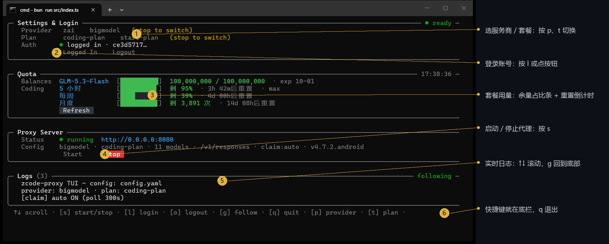
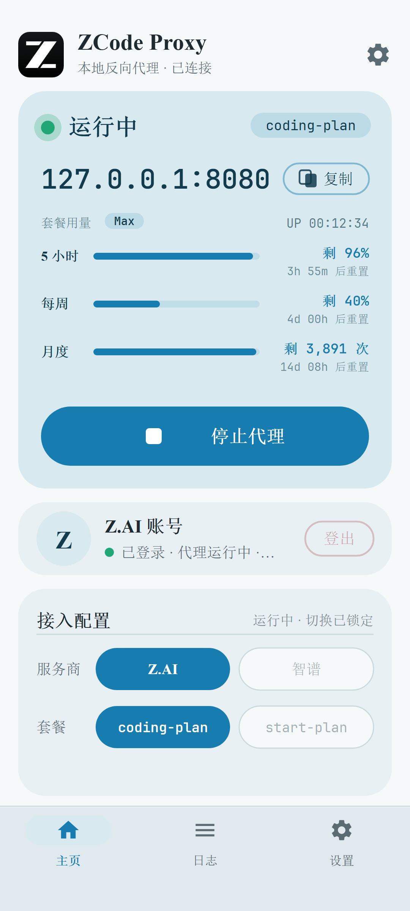
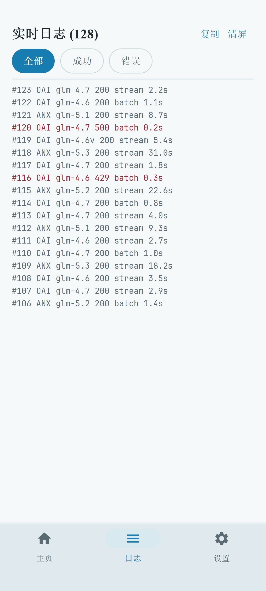
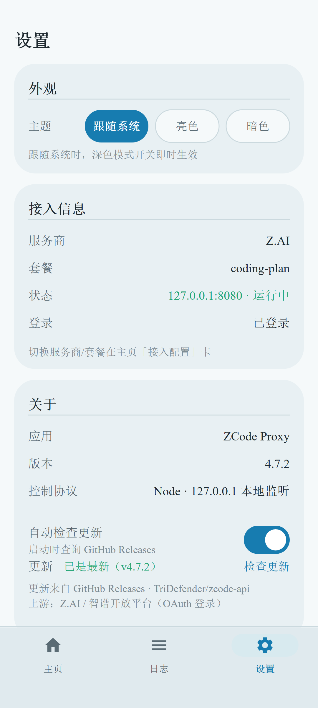
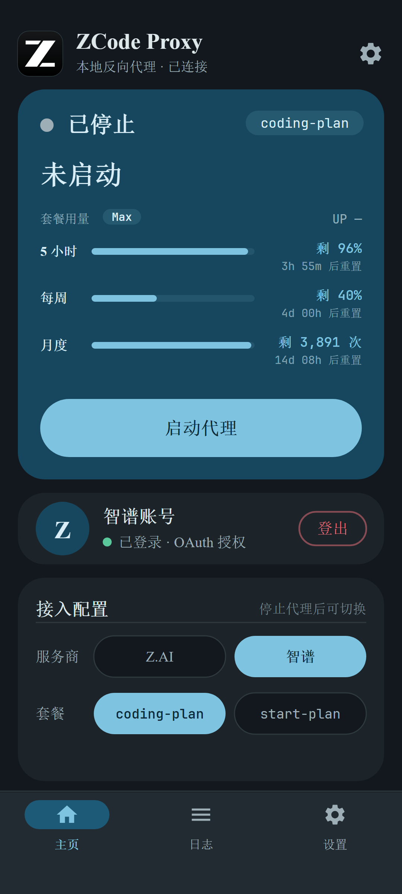

<div align="center">

[中文版](README.md) | [英文版](README_EN.md)


# ZCode Proxy

**Plug your GLM coding plan into every AI coding tool.**

A small utility that runs on your own computer. Coding plans from Z.AI / Bigmodel
(personal / trial plans) normally only work inside the official client — ZCode Proxy
turns them into standard OpenAI / Anthropic APIs on your machine, so Claude Code,
Codex, Silly Tavern … can all use your plan quota directly.

[Quick Start](#-quick-start) · [Connect Your Tools](#-connect-your-coding-tools) · [Android App](#-mobile-android) · [FAQ](#-faq)

</div>

---

## What You Get

- 🧩 **One endpoint, three formats** — OpenAI, Anthropic and Responses (Codex-specific) APIs are all served on local `127.0.0.1:8080`; give each tool whichever format it speaks.
- 🖥️ **Built-in dashboard** — launching in a terminal gives you a visual panel (headless mode also available); start the proxy, log in and watch logs with simple keypresses, even manageable from your phone.
- 📱 **Android app** — start/stop the proxy, watch live logs and switch providers on your phone, handy when you're away.
- 💬 **Web chat included** — open `/webui` for a local ChatGPT-style chat page to try out models.
- 🌙 **Off-peak channel & plan grabber** (optional) — a free-quota channel for off-peak hours and automatic claiming of limited trial plans are both built in.
- 🔌 **In-plan MCP relay** — official ZCode plugin MCPs (Tianyancha / Wind / iFinD…) are relayed to local `/mcp/*` (requires a coding-plan login; `GET /mcp` lists what's available); the built-in web chat can also attach your own MCP servers as tools for the model.
- 🪟 **Cross-platform** — Windows / macOS / Linux run from one codebase; can also be compiled into a single-file executable or deployed with Docker.

## 🚀 Quick Start

### Step 1: download the latest exe from [GitHub Releases](https://github.com/TriDefender/zcode-api/releases)

Yep, that's it. It really is that simple.

After launching, you'll land in the terminal control panel (this is the main UI):



The panel has three areas: **Login & Settings** (provider / plan / login), **Proxy Service** (start/stop, current config) and **Logs** (one line per request, scrolling live). Press <kbd>s</kbd> to start the proxy — once you see `Status: running`, you're ready.

> Not fond of keyboard shortcuts? The panel buttons support **mouse clicks**. Want it to run silently in the background? Use `zcode-proxy.exe --cli serve`.

### Panel Shortcuts

| Key | Action |
|------|------|
| <kbd>s</kbd> | Start / stop the proxy |
| <kbd>l</kbd> | Log in to the current provider (opens the browser for authorization) |
| <kbd>L</kbd> | bigmodel paste login (fallback mode; the `l` login itself is callback-free and works headless) |
| <kbd>o</kbd> | Log out |
| <kbd>p</kbd> / <kbd>t</kbd> | Switch provider (Z.AI ↔ Zhipu) / plan (coding-plan ↔ start-plan) |
| <kbd>↑</kbd><kbd>↓</kbd> / <kbd>PgUp</kbd> / <kbd>g</kbd> | Scroll logs / jump back to the bottom |
| <kbd>c</kbd> | Clear the log screen |
| <kbd>q</kbd> | Quit the panel |

## 🔌 Connect Your Coding Tools

Once the proxy is running, the local address is **`http://127.0.0.1:8080`**. Your tools only need two changes: the **API endpoint** and the **model name**.

About the "API Key": if you've set `auth.proxyApiKey` in the config (or the environment variable `ZCODE_PROXY_API_KEY`), enter the same value in your tool; if not set, enter anything (e.g. `sk-1234`) — purely local use involves no verification.

<details>
<summary><b>Claude Code</b> (click to expand)</summary>

```bash
# macOS / Linux
export ANTHROPIC_BASE_URL=http://127.0.0.1:8080
export ANTHROPIC_AUTH_TOKEN=sk-1234
export ANTHROPIC_MODEL=glm-4.7
claude
```

```powershell
# Windows PowerShell
$env:ANTHROPIC_BASE_URL = "http://127.0.0.1:8080"
$env:ANTHROPIC_AUTH_TOKEN = "sk-1234"
$env:ANTHROPIC_MODEL = "glm-4.7"
claude
```

</details>

<details>
<summary><b>Codex CLI</b> (uses the Responses API)</summary>

Edit `~/.codex/config.toml`:

```toml
model_provider = "zcode"
model = "glm-5.3"

[model_providers.zcode]
name = "ZCode Proxy"
base_url = "http://127.0.0.1:8080/v1"
wire_api = "responses"
env_key = "ZCODE_API_KEY"   # any non-empty value works, unless you've set a proxy key
```

</details>

<details>
<summary><b>Other OpenAI-compatible tools</b> (Cherry Studio, Kilo Code, Cline, LobeChat…)</summary>

In your tool's "Custom Provider" section, fill in:

| Setting | Value |
|--------|-----|
| API address (Base URL) | `http://127.0.0.1:8080/v1` |
| API Key | Your proxy key (anything, if unset) |
| Model | `glm-4.7`, `glm-5.3`, `glm-4.6v`, etc. — see the model table below |

Anthropic-format tools (e.g. some Claude clients) should use `http://127.0.0.1:8080` as the address; the proxy handles the `/v1/messages` path automatically.

</details>

Want to try it manually first? Open **http://127.0.0.1:8080/webui** for the built-in chat page, or use curl:

```bash
curl http://127.0.0.1:8080/v1/chat/completions -H "Content-Type: application/json" -d '{
  "model": "glm-5.3-flash",
  "messages": [{"role": "user", "content": "Hello!"}]
}'
```

## 📱 Mobile (Android)

Download the latest `apk` from [GitHub Releases](https://github.com/TriDefender/zcode-api/releases) and install it. The app mirrors the desktop features: one-tap proxy start, QR-simple configuration, live logs, provider & plan switching, and light/dark themes.

| Home | Logs | Settings | Dark theme |
|:-:|:-:|:-:|:-:|
|  |  |  |  |

The phone and desktop run the same core: the app embeds the full proxy engine, so **the phone itself is a standalone proxy server** — computers on the same LAN can also connect to the proxy address on your phone.

<details>
<summary><b>Docker Deployment</b></summary>

```bash
# Log in on the host with a fixed encryption seed (both providers skip the local callback:
# open the link on any device and the login completes automatically)
ZCODE_PROXY_CREDENTIAL_SECRET="a-passphrase-only-you-know" \
  bun run src/index.ts auth login zai

docker run -d --name zcode-proxy -p 8080:8080 \
  -v "$(pwd)/config.yaml:/data/config.yaml:ro" \
  -v "$(HOME)/.zcode-proxy/credentials.json:/home/bun/.zcode-proxy/credentials.json:ro" \
  -e ZCODE_PROXY_CREDENTIAL_SECRET="a-passphrase-only-you-know" \
  ghcr.io/tridefender/zcode-proxy:latest
```

The image is multi-arch (amd64 / arm64) and runs as the `bun` user. With compose:

```yaml
services:
  zcode-proxy:
    image: ghcr.io/tridefender/zcode-proxy:latest
    ports: ["8080:8080"]
    volumes:
      - ./config.yaml:/data/config.yaml:ro
      - ./credentials.json:/home/bun/.zcode-proxy/credentials.json:ro
    environment:
      ZCODE_PROXY_CREDENTIAL_SECRET: "a-passphrase-only-you-know"
    restart: unless-stopped
```

</details>

<details>
<summary><b>Configuration & Environment Variables</b> (works out of the box either way)</summary>

The config file is `config.yaml` in the project root (auto-generated on first start; see [`config.example.yaml`](config.example.yaml) for fully commented options). Environment variables take precedence. The most useful ones:

| Env variable | Default | Description |
|----------|------|------|
| `ZCODE_PROXY_PORT` | `8080` | Listening port |
| `ZCODE_PROXY_API_KEY` | none | Key clients use to access the proxy (unset = no verification) |
| `ZCODE_PROVIDER` | `zai` | Provider: `zai` / `bigmodel` |
| `ZCODE_PROXY_CONFIG` | `config.yaml` | Config file path |
| `ZCODE_PROXY_CREDENTIAL_SECRET` | machine-specific | Encryption seed for login credentials (fix it when migrating across machines / using Docker) |
| `ZCODE_LOG_FORMAT` | desktop table | Set to `compact` for single-line logs (good for narrow screens) |

The plan type (`plan`: `coding-plan` personal / `start-plan` trial) can be toggled in the panel with <kbd>t</kbd>, which writes the change back to config.yaml.

</details>

<details>
<summary><b>Advanced: Off-peak Channel & Auto Plan Claiming</b></summary>

**Off-peak channel (`/async/*`)** — a free compute channel the official service opens during off-peak hours (e.g. late night). Requests queue up for a ticket first and are automatically sent to the model once their turn arrives (great for non-urgent batch jobs). Enable it with `async.enabled: true` in `config.yaml`; note that it's one-shot with no conversation memory — for multi-turn chats, include the history in the request.

**Weekend/trial plan auto-claiming (claim)** — enabled by default. The proxy probes the official limited-plan campaign page every 5 minutes and grabs new drops for you the instant they appear (`claim.enabled: false` to disable). Manual run: `bun run src/index.ts claim`.

**Quota display (quota)** — after login the panel fetches quota once automatically; refresh manually with <kbd>r</kbd>. Data comes from two upstream planes: trial/credits-plan buckets (`billing/balance`, remaining / total units, expiry) and individual coding-plan usage windows (`/api/monitor/usage/quota/limit`, same endpoint the official usage panel reads — 5-hour / weekly window remaining / total and reset time). CLI: `bun run src/index.ts quota` (HTTP: `GET /quota`). The upstream gateways rate-limit frequent queries, so the panel does not poll on a timer.

</details>

## 🧮 Available Models

The proxy lists the models below under `/v1/models` (the list is for display only — any other model name is still forwarded as-is):

| Model | Context | Max Output |
|------|--------|----------|
| `glm-4.5-air` | 131K | 96K |
| `glm-4.6` | 200K | 131K |
| `glm-4.6v` (vision) | 131K | 32K |
| `glm-4.7` | 200K | 131K |
| `glm-5` / `glm-5-turbo` | 200K | 64K |
| `glm-5v-turbo` (vision) | 200K | 131K |
| `glm-5.1` | 200K | 64K |
| `glm-5.2` | 1M | 128K |
| `glm-5.3` / `glm-5.3-flash` | 1M | 128K |

## ❓ FAQ

**It exits right after startup saying "Not logged in"?**
Log in first: `bun run src/index.ts auth login zai` (or bigmodel). Logging in once is enough; credentials are stored encrypted.

**Port 8080 is already taken?**
Pick another one via an environment variable: `ZCODE_PROXY_PORT=8081 bun run src/index.ts`, or change `server.port` in `config.yaml`.

**My tool can't connect / gets a 401?**
If you've set `ZCODE_PROXY_API_KEY`, your tool must send the same value; without it, no key is required. Note that once the key is enabled, **all routes** except `/webui` (including `/health`) require it.

**Do I need to log in again after switching computers or reinstalling the OS?**
Yes. Credentials are encrypted with machine-bound information. To migrate across machines, set the same `ZCODE_PROXY_CREDENTIAL_SECRET` on both sides, then log in / copy `~/.zcode-proxy/credentials.json`.

**No browser on my server — how do I log in?**
Just log in directly: `bun run src/index.ts auth login zai` (or bigmodel). The login link can be opened in any device's browser; after you authorize, the local side completes automatically (no callback page needed). If you prefer a manual exchange, there's also a paste mode: `auth login bigmodel --paste` — paste back the full URL you're redirected to.

**What does it actually do in the background?**
It's a "translator + courier": it translates the standard requests from your tools into the same requests the official client sends, forwards them, and translates the responses back as-is. All traffic stays between your machine and the official servers — it never passes through any third party.

## 🛠️ Development

```bash
bun test            # run tests
bun x tsc --noEmit  # type check
bun run dev         # start the panel in dev mode
```

For architecture and implementation details, see the comments inside the source files under [`src/`](src/).

## Privacy

The proxy runs fully locally: **no telemetry, no analytics, and no outbound
reporting of any kind**. Nothing about your usage, device, or configuration
leaves your machine; debug/dump logs auto-redact API keys, JWTs, and proxy
keys.

## License

MIT
